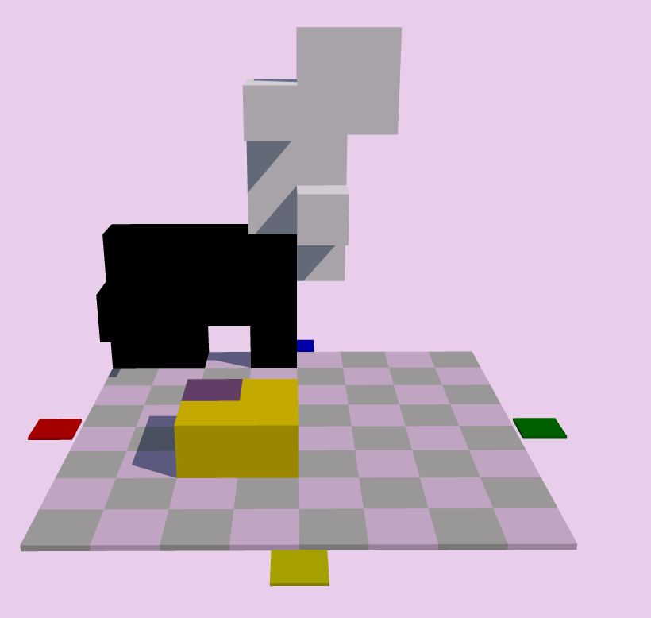

# bridget-ui



A  Web UI for the game [Bridget](https://boardgamegeek.com/boardgame/286904/bridget) written in elm.  
Using benajakuhn's [bridget implementation](https://github.com/benajakuhn/wodsBridget) (written in java) to handle game logic.

The bridge between elm and java is a haskell webserver (scotty) using [inline-java](https://github.com/tweag/inline-java)

## Download Source
...including submodule:
```shell
git clone --recurse-submodules https://github.com/MMMMMNG/bridget-ui.git
cd bridget-ui/
```

## Running the full app:
```shell
cd compose/prod
docker compose up --build
```
Then visit: http://localhost:8000/src/BridgetPage.elm  


**NOTE:** The backend image was 11GB+ on my machine.  
In my opinion that's better than installing 11GB+ worth of [nix](https://nixos.org/) and [bazel](https://bazel.build/) and [haskell](https://www.haskell.org/) dependencies on my PC, though.  
The frontend-image was ~300MB.

## Development
start the dev-containers for front- and backend:
```shell
cd compose/dev
docker compose up -d --build
```
Browse to the frontend: http://localhost:8000/src/BridgetPage.elm  
Now you should be able to develop the frontend. If you need elm tools, get an interactive shell in the frontend container (e.g. exec tab in docker desktop) 

Get an interactive shell in the backend-container (e.g. exec tab in docker desktop) and build the backend:
```shell
nix-shell
bazel build //:bridget_backend
```
and if there are no compiler errors, you can run the compiled polyglot app:
```shell
bazel-bin/bridget_backend
```
### Update stackage_snapshot.json
This is probably not necessary but it seems like it version-locks transitive deps, which is very good for reproducibility.
```shell
bazel run @stackage-unpinned//:pin
```
see also: [haskell.build](https://release.api.haskell.build/haskell/cabal#stack_snapshot)